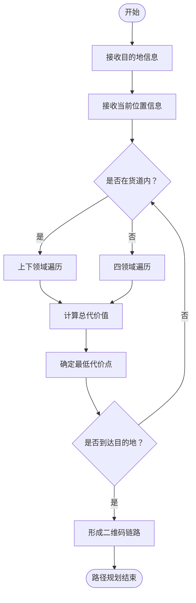

```mermaid
flowchart TD
    A([开始]) --> B[接收目的地信息]
    B --> C[接收当前位置信息]
    C --> D{是否在货道内？}
    
    D -- 是 --> E[上下领域遍历]
    D -- 否 --> F[四领域遍历]
    
    E --> G[计算总代价值]
    F --> G
    
    G --> H[确定最低代价点]
    H --> I{是否到达目的地？}
    
    I -- 否 --> D
    I -- 是 --> J[形成二维码链路]
    J --> K([路径规划结束])
```